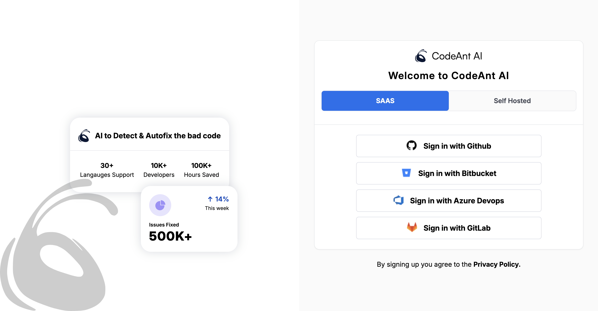
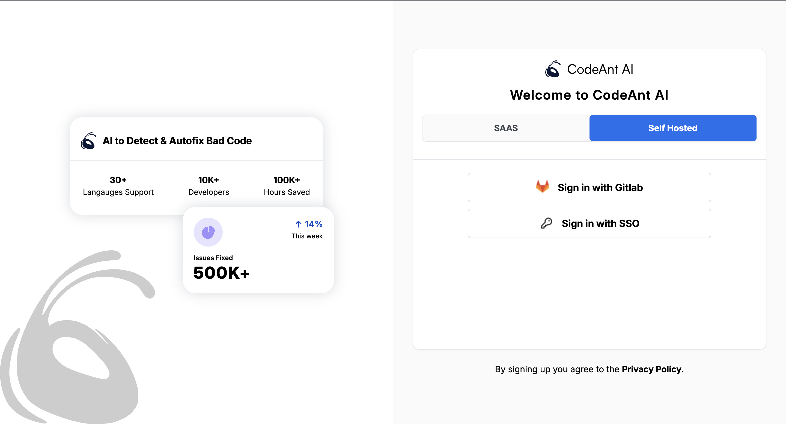
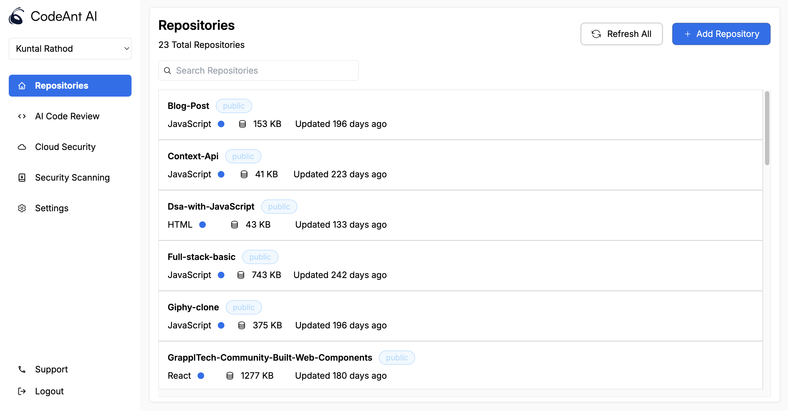
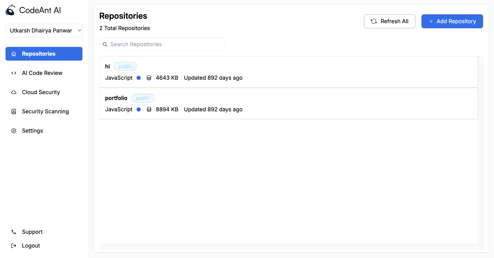
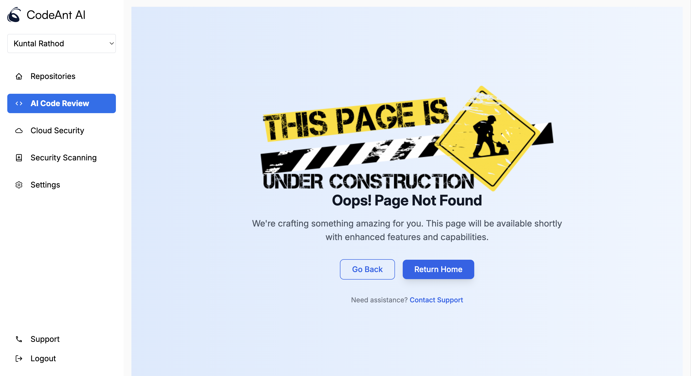

# CodeAnt AI - Assignment

**## Run Locally**

Clone the project

```bash

git clone https://github.com/KuntalRathod/CodeAnt_AI_Assignment.git

```

Go to the project directory

```bash

cd my-project

```

Install dependencies

```bash

npm install

```

Start the server

```bash

npm run dev

```

Open the application in browser:

```bash

http://localhost:5173

```

## Project Demo Video


## Project Structure

```
codeant-ai-assignment/
├── src/
│   ├── components/
│   │   ├── AuthForm.jsx
│   │   ├── AuthPlaceholder.jsx
│   │   ├── Authentication.jsx
│   │   └── Sidebar.jsx
│   ├── pages/
│   │   ├── Auth.jsx
│   │   ├── Home.jsx
│   │   └── NotFound.jsx
│   ├── App.jsx
│   └── main.jsx
├── public/
│   ├── icons/
│   └── output/
├── config/
│   ├── components.json
│   ├── tailwind.config.js
│   └── vite.config.js
└── package.json
```

## 📷 Application Screenshots

### User Authentication

### 1. SAAS Login



### 2. Self-Hosted Login



### Main Dashboard





### Page Under Development



### 🤝 Connect with me:

Feel free to connect with me on [LinkedIn](https://www.linkedin.com/in/kuntalrathod/).
